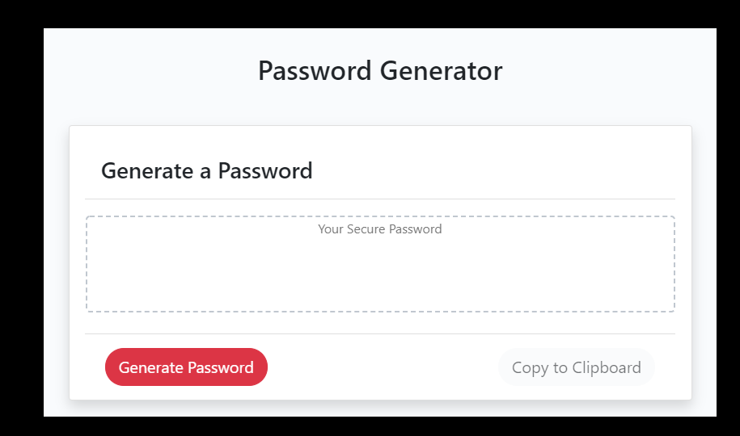

# Password Generator

## Description

This application takes input from the user, and criteria, and generates a random password. There are 5 required inputs from the user.

* Length (must be between 8 and 128 characters)

* Characters:

  * Special characters ( !"#$%&'()*+,-./:;<=>?@[\]^_`{|}~)

  * Numeric characters

  * Lowercase characters

  * Uppercase characters

When the user defines a length. All total of special, numeric, lowercase, and upcase characters must add up to the orignal length defined. 

After the password is generated the "copy to clipboard" button may used to put the random password value in the PC's clipboard.

## Installation

Requires style.css , reset.css, and index.css to be in the current working directory. 

## Usage

click "generate password" a enter the prompts. The initial "overall length" must be between 8 and 128 characters. Then all following questions must add up to the "overall length" that you defined. Once password is generated you may click "copy to clipboard" and copy that password to the PC's clipboard. 
## credits

This program includes bootstrap from http://getbootstrap.com 

